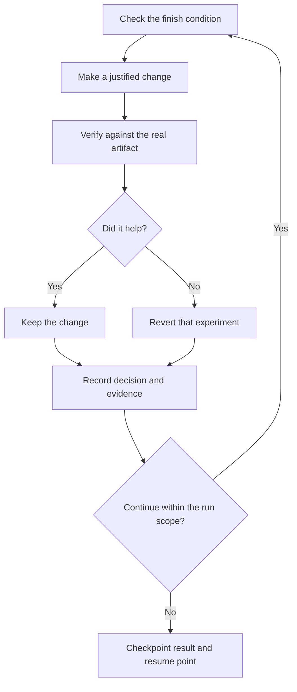

# Run longer tasks

A longer run needs a checkable finish condition and a record you can review later. It also needs an active Codex session or a separately configured execution service. pstack supplies workflow instructions; it does not keep a closed session alive or restart one automatically.

## Define the run

```text
$pstack:poteto-mode migrate every caller to the new parser in a fresh worktree off main.
done means zero old callers, all parser fixtures pass, and the old API is deleted.
keep a decision log. you may commit locally. don't push or merge.
work through bounded attempts while this session is active. if blocked, record the evidence and an exact resume point.
```

The finish condition gives each iteration something to check. The worktree isolates the change. The permission boundary makes clear what Codex can complete while you are away. A checkpoint preserves useful progress if the session ends.

For a large task, [`$pstack:figure-it-out`](../../skills/figure-it-out/SKILL.md) designs the phases before implementation and uses [`$pstack:show-me-your-work`](../../skills/show-me-your-work/SKILL.md) to record decisions.

## Work in verifiable increments



Reverting an experiment must preserve unrelated user work. A plateau is evidence to reconsider the hypothesis, not permission to quietly relax the finish condition. Stop an unproductive investigation at the agreed budget and report what remains unknown.

The [Autonomous run playbook](../../skills/poteto-mode/playbooks/autonomous-run.md) can monitor yielding processes in an active session. A real scheduler may be used only when available, configured, and authorized. Do not infer one from the plugin installation. Use a persistent goal tool only when you ask for one and the host supports it.

## Review the decision trail

A decision log records the time, phase, decision, reason, evidence pointer, and result, usually in `decisions.tsv` or `.audit/<task-slug>.tsv`. Keep it local unless it belongs in the requested deliverable.

```text
$pstack:show-me-your-work catch me up on the parser migration. use the decision log and this session.
```

The audit uses available scoped history or supplied transcripts. It cannot promise access to every previous chat. When independent reviewers or different models are unavailable, the report should say so.

## Pause and resume

```text
$pstack:poteto-mode pause safely. record the branch, completed checks, remaining work, and how to resume.
```

The [Pause safely playbook](../../skills/poteto-mode/playbooks/pause-safely.md) preserves a handoff. In a later session:

```text
$pstack:poteto-mode resume the parser migration from this checkpoint and branch. verify the recorded state before continuing.
```

The [Session pickup playbook](../../skills/poteto-mode/playbooks/session-pickup.md) checks the actual repository state. It does not assume old workers survived a restart.

## Larger queues are optional

For solo work, one active task and a checkpoint are often sufficient. The advanced playbooks remain available when the work warrants them:

- [Autopilot-stack](../../skills/poteto-mode/playbooks/autopilot-stack.md) prepares a linear stack for you to review and land.
- [Autopilot-full](../../skills/poteto-mode/playbooks/autopilot-full.md) coordinates independent PRs through merge when you request that scope and the required independent verification is available.
- [Orchestrate](../../skills/poteto-mode/playbooks/orchestrate.md) coordinates a larger program through durable briefs and stored results. Its Graphite frontier workflow requires `gt`.

All delegation uses actual host capabilities and bounded concurrency. A request for a long run does not create unlimited workers, cross-model access, or permission to publish.

Next: [Steer with principle names](./08-principles.md).
